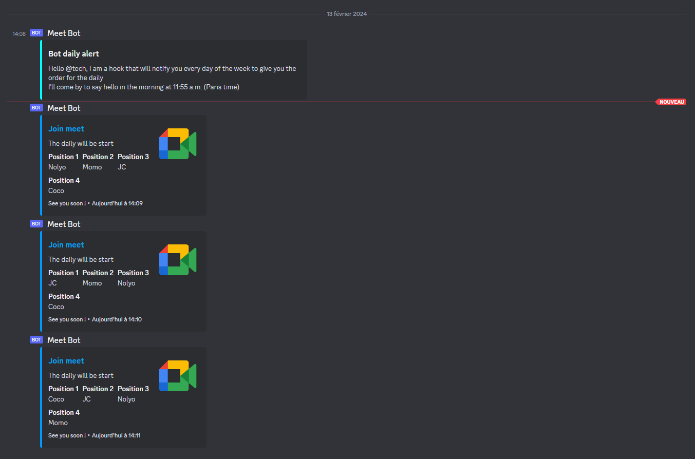

# Discord Random picker bot

A simple bot that picks a random order of a list of names for your daily standup or any other activity.



### How to install

```bash
git clone https://github.com/Nolyo/random-pick
cd random-pick
npm install
```

### Configuration

copy the `.env.example` file to `.env` and fill in the required fields.

```bash
cp .env.example .env
```

## How to get a bot token and webhook url

### Bot token

Create a new bot on the [Discord Developer Portal](https://discord.com/developers/applications) and copy the token.
if you don't see your token, click on `Bot` in the left menu and then `Reset Token` (\*1).

You should activate Intents privileged gateway intents in the `Bot` section of your bot settings. (\*2)


### Webhook url

Create a new webhook in the channel you want the bot to send messages to. Go to the channel settings, `Integrations` and `Webhooks`. Create a new webhook and copy the url.


## How to run

### Docker

```bash
docker-compose up -d
```

if you run for the first time
you need to build with the `--build` flag

```bash
docker-compose up -d --build
```

### Node

```bash
npm start
```

## How to use

- update `src/config.json` with the list of jobs alerts you want to use
- If you want use mention: [Discord mention documentation](https://v12.discordjs.guide/miscellaneous/parsing-mention-arguments.html#how-discord-mentions-work)

## Comming soon

This project is still in development and will be updated regularly. Here are some features that will be added soon:

- [x] Better user configuration
- [x] Better cron configuration
- [x] Docker support
- [x] Add tests
- [x] Add CI/CD
- [ ] Better error handling
- [ ] Better documentation
- [ ] Interface for dynamic configuration (cron, users, etc) ?
